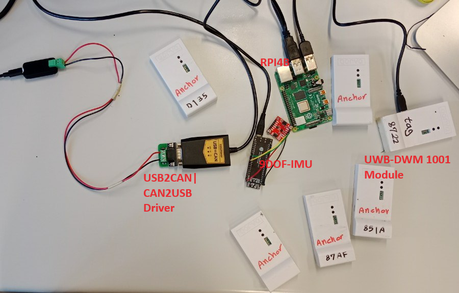

# Localization Service using Ultra Wide Band DWM-1001 and SparkFun 9DoF IMU

This project is a modular localization service designed for integration with the Controller Area Network (CAN) of a vehicle. It utilizes Ultra Wide Band (UWB) DWM-1001 and SparkFun 9DoF IMU - ISM330DHCX, MMC5983MA (Qwiic) for localization, based on CAN serial communication.



## Getting Started

To get started, follow the steps provided in this README and the detailed documentation. Note that the installation of ROS2 is necessary to provide the messaging packages essential for data streaming through CAN.


### Prerequisites

- Python 3
- can-utils (CAN utilities)
- Python CAN library
- ROS2 (Robot Operating System 2)

### Installation


Ensure your system is up-to-date and the necessary CAN utilities are installed:


```sh
sudo apt-get update
sudo apt-get install can-utils
sudo modprobe can
sudo ip link set can0 up type can bitrate 500000
ifconfig can0
```


Verify CAN communication using the following commands:

```sh
cansend can0 123#DEADBEEF
candump can0
```


Install the Python CAN library to handle CAN messages programmatically:

```sh
sudo apt install python3-pip
pip3 install python-can
```

Installing ROS2 Humble on Debian-based Ubuntu Systems
Set Locale

Ensure your locale is set to UTF-8:

```sh
locale  # check for UTF-8
sudo apt update && sudo apt install locales
sudo locale-gen en_US en_US.UTF-8
sudo update-locale LC_ALL=en_US.UTF-8 LANG=en_US.UTF-8
export LANG=en_US.UTF-8
locale  # verify settings
```

Enable Ubuntu Universe Repository:

```sh
sudo apt install software-properties-common
sudo add-apt-repository universe
```

Add the ROS 2 GPG Key:

```sh
sudo apt update && sudo apt install curl -y
sudo curl -sSL https://raw.githubusercontent.com/ros/rosdistro/master/ros.key -o /usr/share/keyrings/ros-archive-keyring.gpg
```

Add the ROS 2 Repository:

```sh
echo "deb [arch=$(dpkg --print-architecture) signed-by=/usr/share/keyrings/ros-archive-keyring.gpg] http://packages.ros.org/ros2/ubuntu $(. /etc/os-release && echo $UBUNTU_CODENAME) main" | sudo tee /etc/apt/sources.list.d/ros2.list > /dev/null
```


Update Repository Caches:

```sh
sudo apt update
sudo apt upgrade
```


Install the ROS-Base (Bare Bones) package, which includes communication libraries, message packages, and command line tools, but no GUI tools:

```sh
sudo apt install ros-humble-ros-base
```

Set Up Environment:

```sh
source /opt/ros/humble/setup.bash
```


Reboot your system to apply the changes:

```sh
sudo reboot
```


### Service Execution

The localization system consists of two units, the processing units which is running the localization service and the receiver units which could be an Electronic Control Units (ECU) or any other embedded platform that suppports a physical controller area network connection. To make the service run, copy and paste the three files in the src folder to the processor unit or sender : "dwm1001_apiCommands.py", "dwm1001_systemDefinitions.py", "send.py". Please notice that, the "recieve.py" is just an example to receive and decode the  CAN messages, and the receiver machine does not require to support ubuntu or python.

### CAN Table

# CAN Communication Scripts

## Overview

This repository contains Python scripts for transmitting and receiving CAN messages. The scripts are designed to read data from IMU and UWB sensors, process the data, and transmit it over a CAN bus. The receiver script listens for the CAN messages, reconstructs the data, and prints the decoded position and attitude information.

## CAN Message Table

| Message ID (Hex) | Message Name   | DLC (Data Length Code) | Data Byte 0-7                                         | Description                           |
|------------------|----------------|------------------------|-------------------------------------------------------|---------------------------------------|
| 0x123            | UWB/IMU Data 1 | 8                      | X position (float), Y position (first half, float)   | UWB position data (first part)        |
| 0x124            | UWB/IMU Data 2 | 8                      | Y position (second half, float), Z position (float)  | UWB position data (second part)       |
| 0x125            | UWB/IMU Data 3 | 8                      | Pitch (float), Roll (float), Yaw (float)             | IMU attitude data                     |

### Explanation

- **Message ID 0x123**: This message contains the first part of the UWB position data. The data includes:
  - **Data Byte 0-3**: X position (4 bytes, float)
  - **Data Byte 4-7**: First half of the Y position (4 bytes, float)

- **Message ID 0x124**: This message contains the second part of the UWB position data. The data includes:
  - **Data Byte 0-3**: Second half of the Y position (4 bytes, float)
  - **Data Byte 4-7**: Z position (4 bytes, float)

- **Message ID 0x125**: This message contains the IMU attitude data. The data includes:
  - **Data Byte 0-3**: Pitch (4 bytes, float)
  - **Data Byte 4-7**: Roll (4 bytes, float)
  - **Data Byte 8-11**: Yaw (4 bytes, float)

## Transmitting Script Breakdown

The transmitting script reads data from IMU and UWB sensors, processes it, and sends the data in the following way:

- IMU data (acceleration, gyroscope) is read and converted into appropriate units.
- The script calculates pitch, roll, and yaw using a complementary filter.
- UWB position data (X, Y, Z) is read from the UWB sensor.
- The combined data (UWB position and IMU attitude) is packed into three CAN messages:
  - The first message (ID 0x123) contains the X position and the first half of the Y position.
  - The second message (ID 0x124) contains the second half of the Y position and the Z position.
  - The third message (ID 0x125) contains the pitch, roll, and yaw values.

## Receiving Script Breakdown

The receiving script listens for CAN messages and reconstructs the data:

- The script continuously listens for messages with IDs 0x123, 0x124, and 0x125.
- Once all three messages are received, the data is combined and unpacked.
- The combined data is split into two arrays:
  - The first array contains the X, Y, and Z position values.
  - The second array contains the pitch, roll, and yaw values.
- The script prints out the decoded position and attitude data.


### Setup Deployement
Follow the instructions in the "MDEK1001_Quick_Start_Guide_1.3c" in the "docs" folder to deploy the UWB anchors. After installing the UWB anchors, use the APK software to visualize the target (e.g., autonomous vehicle) position on the grid plan shown in the app. Once you can see the target position on the grid, the setup is ready, and you no longer need the app.

Next, connect the tag (and the IMU unit) to the sender embedded device using a UART connection. Run the "send.py" script to calculate the vehicle's pose and attitude at a frequency of 10 Hz and communicate this information via CAN serial communication. To read the CAN messages with an ECU, simply connect the output from the USB-to-CAN adapter to the ECU.

Please note that the setup deployment is only required initially; once completed, the system will operate without any further measure.

